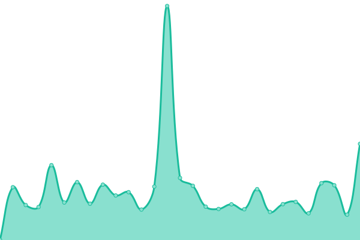
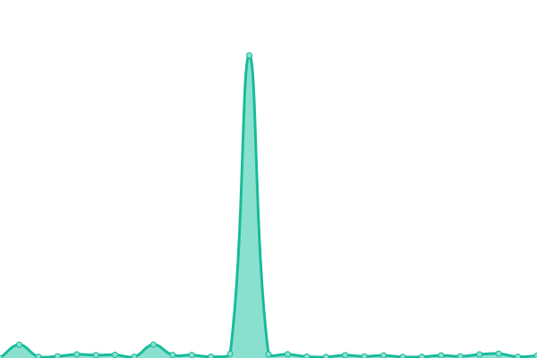
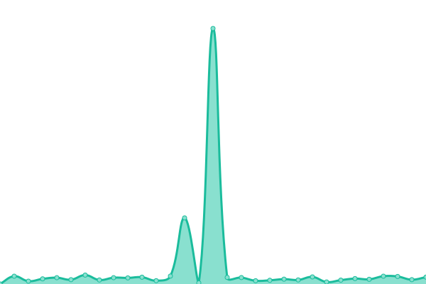
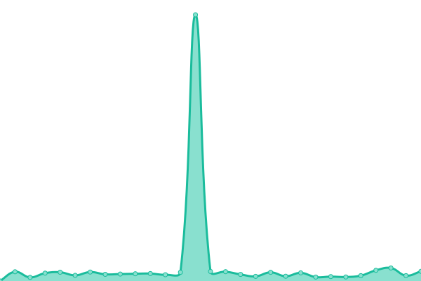
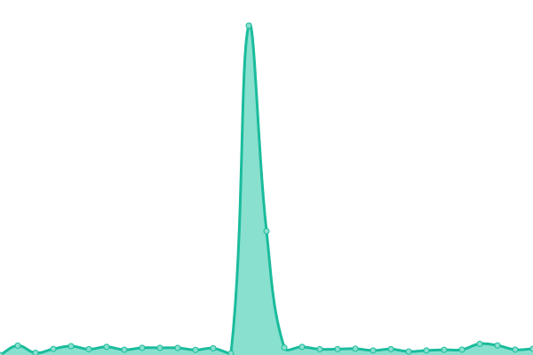
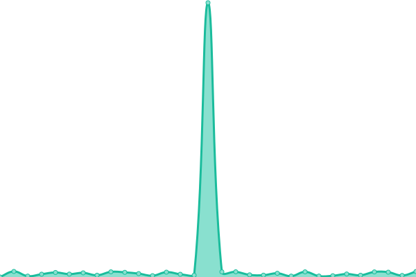

# [📈 現在の状態](https://status.scp-jp.org): <!--live status--> **🟧 部分的な停止**

This repository contains the open-source uptime monitor and status page for [SCP-JP Tech](https://status.scp-jp.org), powered by [Upptime](https://github.com/upptime/upptime).

With [Upptime](https://upptime.js.org), you can get your own unlimited and free uptime monitor and status page, powered entirely by a GitHub repository. We use [Issues](https://github.com/SCP-JP/wikdotupptime/issues) as incident reports, [Actions](https://github.com/SCP-JP/wikdotupptime/actions) as uptime monitors, and [Pages](https://status.scp-jp.org) for the status page.

<!--start: status pages-->
<!-- This summary is generated by Upptime (https://github.com/upptime/upptime) -->
<!-- Do not edit this manually, your changes will be overwritten -->
<!-- prettier-ignore -->
| URL | 状態 | 履歴 | 応答時間 | 稼働時間 |
| --- | ------ | ------- | ------------- | ------ |
|  [Wikidot](https://www.wikidot.com/) | 🟩 正常 | [wikidot.yml](https://github.com/SCP-JP/wikdotupptime/commits/HEAD/history/wikidot.yml) | 

 357ミリ秒
     
 | 

<a href="https://status.scp-jp.org/history/wikidot">100.00%</a>
    

|  [SCP-JP MAINサイト](http://scp-jp.wikidot.com/) | 🟩 正常 | [scp-jp-main.yml](https://github.com/SCP-JP/wikdotupptime/commits/HEAD/history/scp-jp-main.yml) | 

 210ミリ秒
     
 | 

<a href="https://status.scp-jp.org/history/scp-jp-main">100.00%</a>
    

|  [SCP-JP サンドボックスⅢ(SB3)](http://scp-jp-sandbox3.wikidot.com/) | 🟥 停止 | [scp-jp-sb-3.yml](https://github.com/SCP-JP/wikdotupptime/commits/HEAD/history/scp-jp-sb-3.yml) | 

 1059ミリ秒
     
 | 

<a href="https://status.scp-jp.org/history/scp-jp-sb-3">99.77%</a>
    

|  [SCP-JP ファイルストレージ(FS)](http://scp-jp-storage.wikidot.com/) | 🟩 正常 | [scp-jp-fs.yml](https://github.com/SCP-JP/wikdotupptime/commits/HEAD/history/scp-jp-fs.yml) | 

 390ミリ秒
     
 | 

<a href="https://status.scp-jp.org/history/scp-jp-fs">99.78%</a>
    

|  [SCP-JP 財団日本支部理事会(05)](http://05command-ja.wikidot.com/) | 🟩 正常 | [scp-jp-05.yml](https://github.com/SCP-JP/wikdotupptime/commits/HEAD/history/scp-jp-05.yml) | 

 1041ミリ秒
     
 | 

<a href="https://status.scp-jp.org/history/scp-jp-05">100.00%</a>
    

|  [SCP-JP AMC](https://scp-jp.wikidot.com/ajax-module-connector.php) | 🟩 正常 | [scp-jp-amc.yml](https://github.com/SCP-JP/wikdotupptime/commits/HEAD/history/scp-jp-amc.yml) | 

 148ミリ秒
     
 | 

<a href="https://status.scp-jp.org/history/scp-jp-amc">100.00%</a>
    

<!--end: status pages-->

[**Visit our status website →**](https://status.scp-jp.org)

## 📄 License

- Powered by: [Upptime](https://github.com/upptime/upptime)
- Code: [MIT](./LICENSE) © [SCP-JP Tech](https://status.scp-jp.org)
- Data in the `./history` directory: [Open Database License](https://opendatacommons.org/licenses/odbl/1-0/)
